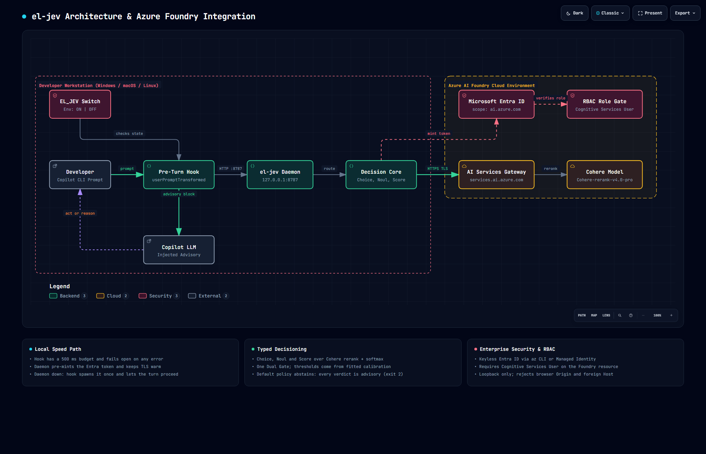
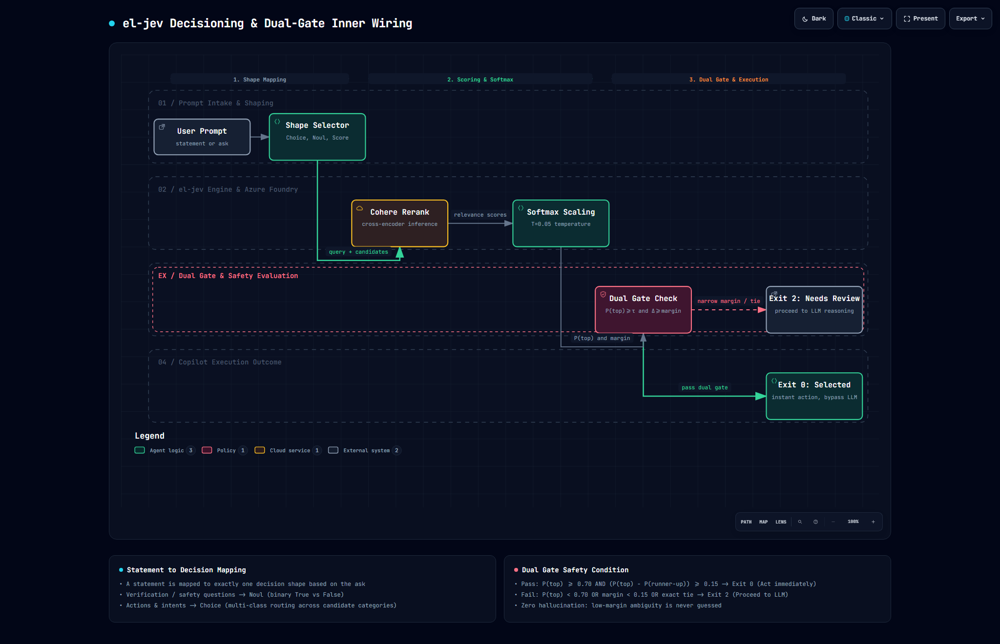

# el-jev architecture and decisioning

`el-jev` is a typed decision sidecar for Copilot CLI. It runs a loopback daemon, evaluates bounded decision tasks against Cohere rerank, and returns an auditable `eljev.decision/1` record with explicit abstention behavior.

## Interactive schematics

- 🌐 [System schematic](architecture.html)
- 🌐 [Decisioning flow schematic](decisioning-flow.html)
- 🌐 [Jev vs el-jev comparison](jev-vs-el-jev.html)

## Jev System One vs el-jev

> **Bottom line:** TypeSafe Jev is intended to be a typed decision primitive inside application-owned control flow. `el-jev` recreates the bounded decision surface with Foundry-hosted Cohere Rerank, while the current GitHub Copilot integration injects the result as advisory context rather than enforcing the route.

### Architecture comparison

| Dimension | TypeSafe Jev pattern | `el-jev` decision service | GHCP hook adapter |
|---|---|---|---|
| Workflow owner | Deterministic application code | The calling application, CLI, MCP client, or harness | GitHub Copilot LLM |
| Decision input | Purpose-selected state and one or more typed questions | State plus one `choice`, `noul`, `score`, or `screen` request | The transformed user prompt, normally classified into five fixed intents |
| Decision engine | Purpose-built System One model | Cohere Rerank over answer descriptions | The `el-jev` daemon and Cohere engine |
| Probability semantics | Native typed decision distribution | Derived from relevance scores and calibration | Same derived decision record |
| Policy enforcement | Application code branches on the returned decision | Returns `selected` or `needs_review`; the caller must explicitly enforce `selected` | Adds an `[el-jev advisory]` block that Copilot may follow or override |
| LLM invocation | Only when the selected branch needs generation or reasoning | Optional in a custom orchestrator | Copilot still runs after the hook |
| Operational role | Decision primitive embedded in software | Decision sidecar with audit, gating, and abstention | Pre-turn intent annotation |

### Service boundary and deployment

The GHCP hook is configured to use `el-jev`, but it is an integration adapter rather than the decision service itself:

```text
GHCP hook                 CLI / MCP / custom application
     \                               /
      ------> local el-jev daemon <--
                       |
                       ------> Foundry Cohere Rerank
```

The same daemon API can therefore serve the hook, the CLI, the MCP surface, or custom local orchestration.

| Deployment mode | Current support | Description |
|---|---|---|
| Local sidecar | Supported | Daemon binds to `127.0.0.1:8787`; local callers use the typed decision API |
| Separate local process without GHCP | Supported | CLI, MCP, or custom code can use the daemon without installing the Copilot hook |
| Shared remote service | Not supported as-is | Requires a networked service boundary and production authentication, isolation, and observability |

Remote hosting would require changing the current loopback assumptions: bind behind HTTPS, authenticate clients, make the service URL and `Host` behavior configurable, isolate tenants and logs, apply rate limits, and use managed identity for the Foundry call. `ELJEV_SYSTEMONE_URL` configures a remote decision-engine backend; it does not make the local `el-jev` daemon remotely accessible.

### Intended Jev control loop

1. Application code reaches a narrow decision point.
2. Code sends only the required state and typed questions to Jev.
3. Jev returns structured answers, probabilities, and confidence.
4. Application policy accepts, abstains, or escalates.
5. Code invokes an LLM, tool, deterministic action, or human only for the selected branch.

### Current GitHub Copilot control loop

1. Copilot emits a `userPromptTransformed` hook event.
2. The hook sends the prompt to the loopback `el-jev` daemon.
3. In default `intent` mode, Cohere scores five intent descriptions.
4. `el-jev` converts those relevance scores into probabilities and applies its gate.
5. The hook appends the decision as an advisory block.
6. Copilot reads the advisory but independently chooses its tools and actions.

This distinction matters for latency and cost. The decision itself can replace a slower LLM routing call in a custom harness, but the current prompt hook does not prevent the main Copilot LLM call. It is therefore best understood as a safe integration and evaluation surface for Jev-style routing, not yet a binding router for Copilot CLI.

### Best-fit el-jev use cases

| Use case | Fit | Why |
|---|---|---|
| Bounded intent, model, tool, or sub-agent selection | Strong | Candidate descriptions map naturally to reranking |
| Screening a large candidate set | Strong | `screen` directly uses Cohere's native ranking behavior |
| Binary approval or safety gate | Experimental | `noul` is represented as competing true/false candidates and requires labelled calibration |
| Ordered severity or priority | Experimental | `score` is represented as competing ordered level descriptions |
| Copilot pre-turn guidance | Advisory | Useful for observing routing quality, but Copilot retains control |
| Avoiding an LLM call entirely | Requires custom orchestration | A wrapper or agent harness must call `el-jev` before selecting the downstream branch |

## Topology diagrams





## Topology summary

- **Hook surface:** Copilot `userPromptTransformed` via `hooks/eljev_pre_turn.py`.
- **Daemon:** loopback-only HTTP service on `127.0.0.1:8787`.
- **Engine:** Cohere rerank route on Azure AI Foundry with Entra auth.
- **State/logs:** repo-local `.eljev/` (`config.json`, `daemon.pid`, `spawn.stamp`, logs).
- **Config precedence:** environment variable > `config.json` > default.

## Statement-to-decision mapping

A prompt is mapped to a typed shape instead of a free-form completion:

| Shape | Input form | Typical use |
|---|---|---|
| `choice` | fixed option list | routing, triage, categorical selection |
| `noul` | binary decision | yes/no gate with probabilities |
| `score` | ordered levels | severity/priority scoring |
| `screen` | open candidate list (1-250) | reranking against a criterion |

In hook `intent` mode, auto-classification is a **choice** over five intents (`code_modification`, `review_audit`, `investigation_search`, `execution_testing`, `advisory_explanation`) for prompts meeting min-word and length bounds. `noul` and `score` are reached through explicit marker payloads, CLI, or MCP calls.

## Dual-gate decision policy

All shapes use one gate implementation (`apply_gate`) after probabilities are produced.
`selected` (exit 0) requires both conditions:

- `p(top) >= τ`
- `p(top) - p(runner_up) >= Δ`

`τ` and `Δ` come from calibration data, not fixed runtime constants.
Default policy (`always_abstain_v0`) forces non-trivial outputs to `needs_review` (exit 2).

## Fail-closed and advisory behavior

- Cohere malformed output -> `invalid_response` (exit 2), no selected decision.
- Cohere transport/auth/rate/timeout failures -> `engine_error` (exit 2), advisory only.
- If endpoint is not configured, local heuristic is explicitly untrusted (`needs_review`), never `selected`.

## Daemon lifecycle and warm path

- Daemon start is idempotent and writes its own JSON pidfile (`pid`, `port`, `started_at`, `exe`).
- `daemon stop` asks a live daemon to exit via `POST /v1/shutdown`. It only terminates a pid taken from the pidfile when the process creation time proves it is the daemon that wrote it, so a recycled pid is never killed.
- Windows uses exclusive bind; second daemon cannot bind the same port.
- Stop path calls `POST /v1/shutdown`, then terminates pid if needed.
- Orphan recovery uses `/health` pid checks when pidfile is stale or absent.
- Hook spawn is debounced through `.eljev/spawn.stamp`; no prompt-path sleep.
- Warm-up thread pre-mints Entra token and primes TLS on start, then every 30s, replacing an idle keep-alive connection the server has already closed.

## Loopback hardening

Daemon rejects:

- requests with any `Origin` header (403)
- `Host` not `127.0.0.1` / `localhost[:port]` (403)
- POST without `Content-Type: application/json` (415)

This prevents browser and DNS-rebinding abuse against paid remote calls.

## Authentication model

- `azcli` mode: uses `az account get-access-token -o json`, caches token with real expiry, refreshes five minutes early.
- `managed_identity` mode: supports IMDS and App Service identity endpoint/header; `AZURE_CLIENT_ID` selects user-assigned identity.
- Required scope: `https://ai.azure.com/.default`.
- Required role: **Cognitive Services User** on the AI Services resource.

## API surfaces

- `GET /health`: includes pid, warm state, auth mode, and engine readiness.
- `POST /v1/screen`: Shape B rerank.
- `POST /v1/decide`: Shape A `choice | noul | score`.
- `GET /v1/log`: recent decision records.
- `POST /v1/shutdown`: controlled daemon stop.
